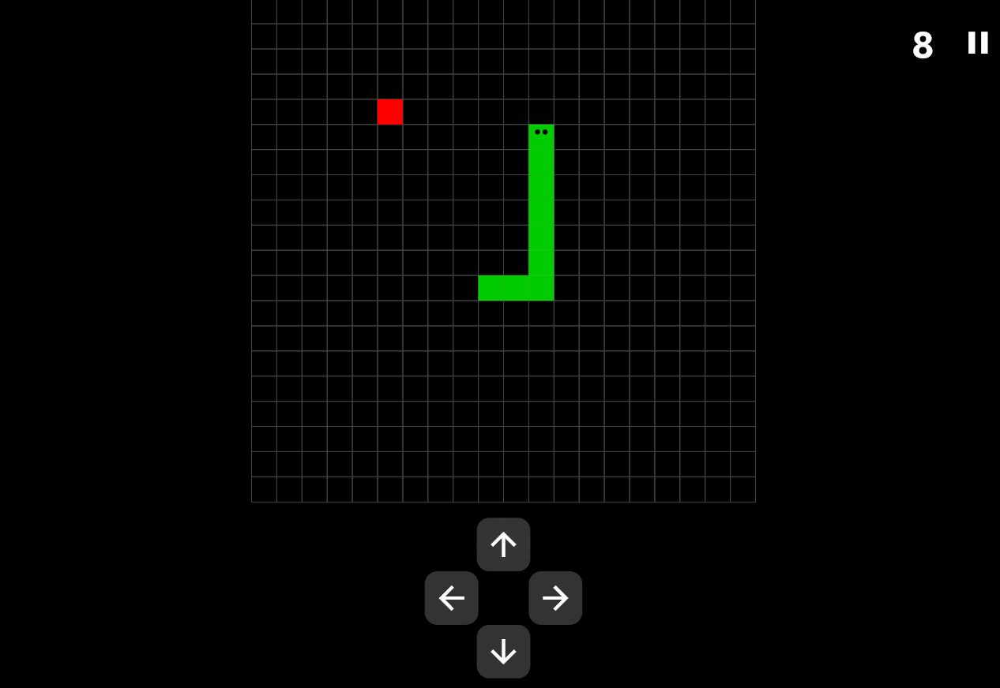
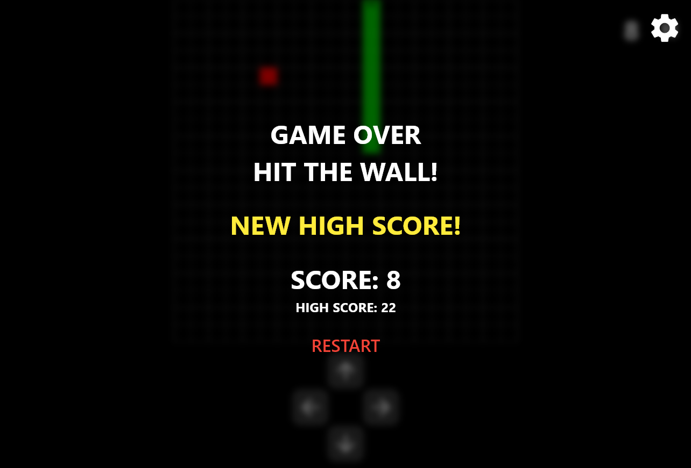
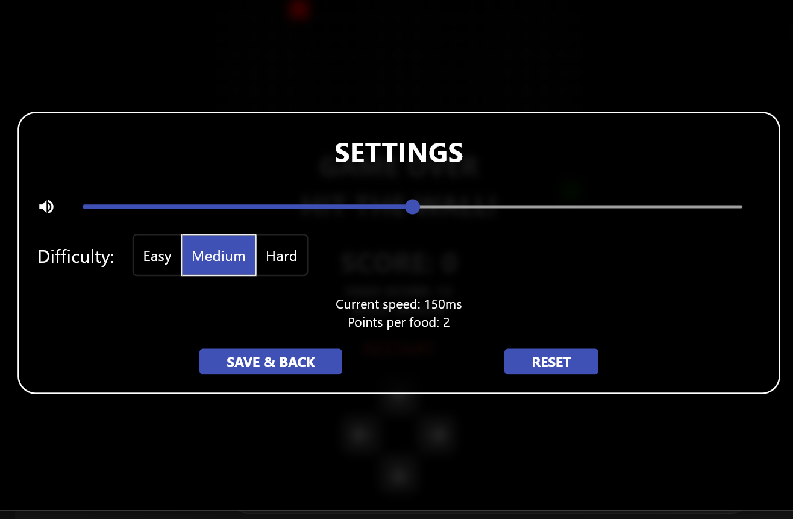

# 🐍 Flutter Snake Game

A simple but addictive Snake game built with [Flutter](https://flutter.dev/). This project demonstrates how to use Flutter to create a classic arcade-style game with a modern UI and responsive controls.

## 🚀 Features

- Classic snake gameplay
- Responsive touch controls
- Dynamic difficulty scaling
- Simple and clean UI
- Written entirely in Dart using Flutter framework

## 📱 Screenshots

| Gameplay | Game Over | Settings |
|----------|-----------|----------|
|  |  |  |